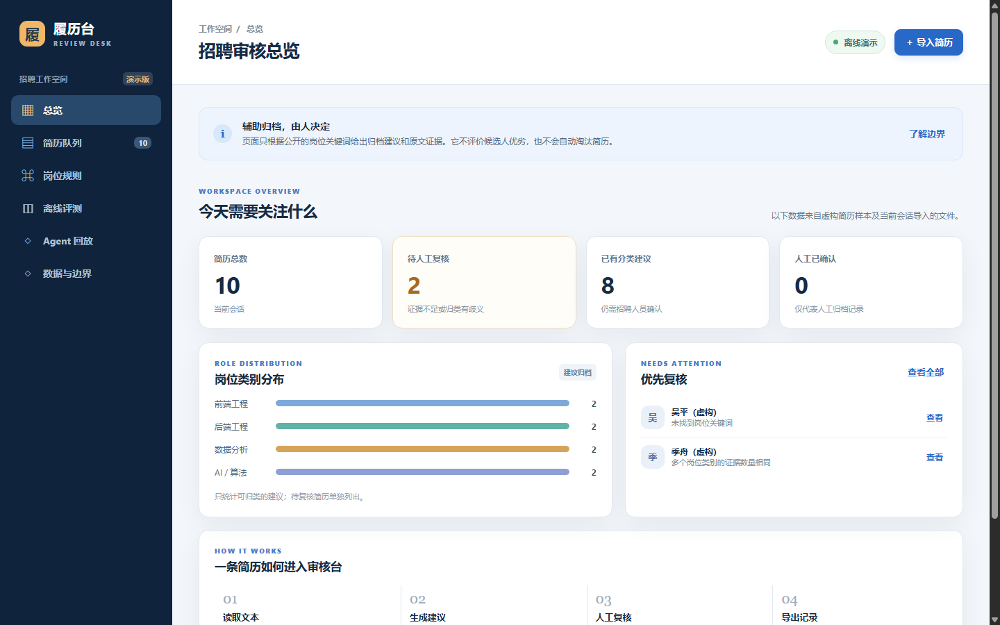
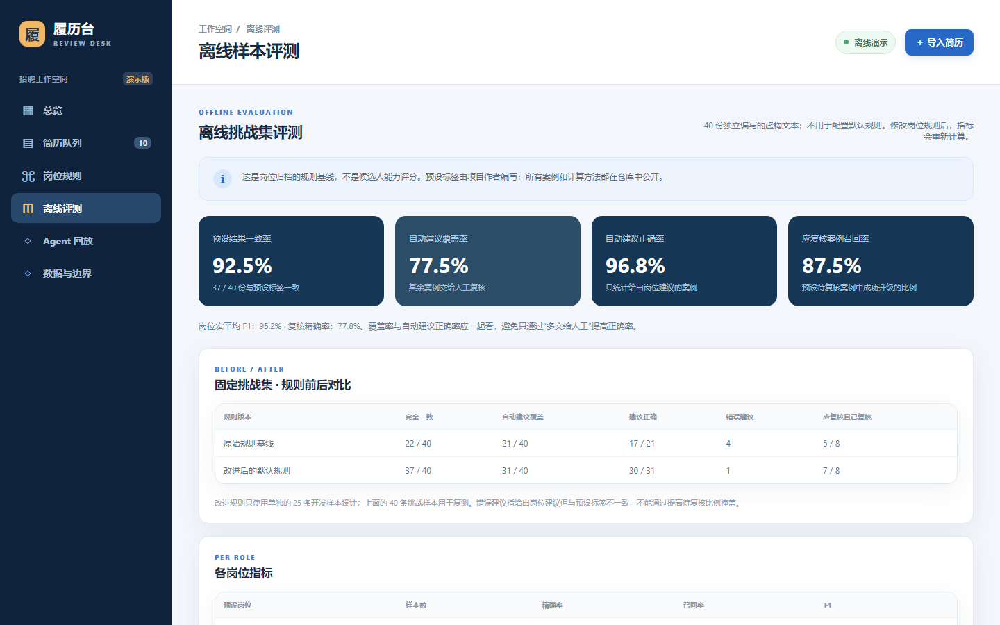
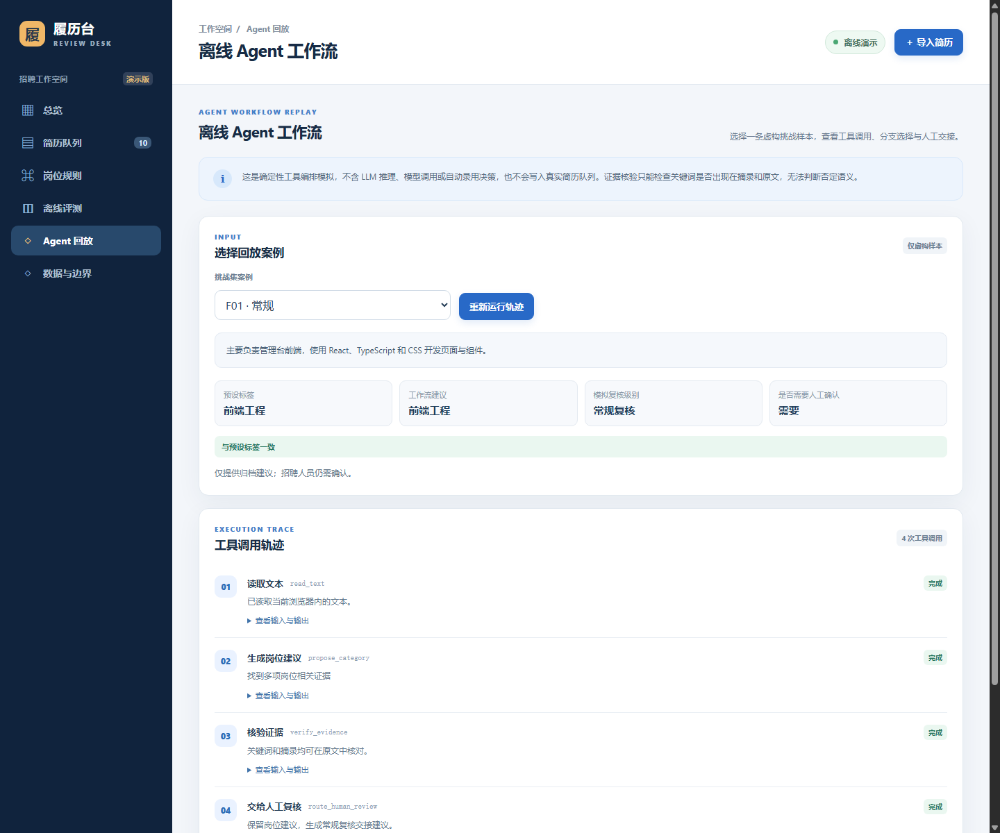
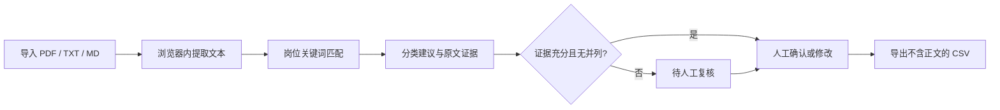

# 履历台 · Resume Review Desk

一个面向企业招聘人员的**简历归档与人工复核原型**。输入可提取文本的 PDF、TXT 或 MD 简历，页面在浏览器本地寻找岗位关键词，展示原文证据，把证据不足或类别冲突的简历交给人工复核。它不决定录用或淘汰。

> 当前是完全离线的作品集原型：无需 OpenAI API Key，不调用付费模型，也不上传真实候选人数据。



## 3 分钟看项目

当前[在线演示](https://resume-review-desk-guo.guolinghao6.chatgpt.site/#overview)仅仓库所有者可访问。其他读者可以先看下方截图，或按[本地运行](#本地运行)启动静态站点；页面不需要 API Key。

| 用时 | 操作 | 看什么 |
| --- | --- | --- |
| 30 秒 | 打开[总览](https://resume-review-desk-guo.guolinghao6.chatgpt.site/#overview) | 10 份虚构简历、分类建议与待复核数量 |
| 60 秒 | 进入[简历队列](https://resume-review-desk-guo.guolinghao6.chatgpt.site/#queue)，打开待复核条目 | 原文证据、原因、人工确认与说明 |
| 60 秒 | 查看[离线评测](https://resume-review-desk-guo.guolinghao6.chatgpt.site/#evaluation) | 40 条独立挑战样本、覆盖率、正确率和错误案例 |
| 30 秒 | 打开[Agent 回放](https://resume-review-desk-guo.guolinghao6.chatgpt.site/#workflow)，切换 F01、F03、R05 | 正常路径、证据不足路径及规则误判；展开工具输入与输出 |

页面导航支持 `#overview`、`#queue`、`#rules`、`#evaluation`、`#workflow`、`#privacy`，本地启动后也能使用相同的链接片段。更完整的讲解见[演示脚本](docs/DEMO.md)。

### 页面截图

| 离线评测 | Agent 工作流回放 |
| --- | --- |
|  |  |

## 当前功能

- 10 份虚构简历作为演示样本；支持批量拖入本地文件，单文件上限 5 MB、PDF 上限 20 页。
- 四类可编辑岗位规则：前端工程、后端工程、数据分析、AI / 算法。
- 显示命中关键词和原文摘录；证据少于两项或类别并列时标记“待人工复核”。
- 人工确认类别并填写理由；每次复核保留规则版本、当时的关键词快照、系统建议、修改前后类别与时间。支持筛选、搜索，分别导出当前记录和逐次复核日志（均不含简历全文）。
- 10 份虚构简历用于界面演示；另有 40 份独立编写的挑战样本，用于展示规则基线和错误分析。
- “Agent 回放”页展示离线工具编排、分支选择、证据核验与人工交接的完整轨迹。

## 处理流程



核心逻辑位于 `dist/classifier.mjs`，复核事件结构位于 `dist/review-audit.mjs`，浏览器交互位于 `dist/app.mjs`。首页演示数据在 `dist/demo-data.mjs`；挑战集及计算逻辑分别在 `dist/benchmark-data.mjs` 和 `dist/benchmark.mjs`。`tests/` 覆盖分类边界、评测指标、复核事件和 PDF 文本提取。

## 人工复核日志

“简历队列 → 查看详情”会显示当前规则版本。每次人工确认都必须填写理由，并**追加**一条复核事件；再次修改不会覆盖旧记录。事件保存复核时间、当时的规则版本及关键词快照、规则建议、修改前类别和人工结果。“仍待进一步确认”会继续出现在待复核队列。队列提供当前记录 CSV 与逐次复核日志 CSV，均不包含简历正文。

这些记录只存在当前浏览器会话，刷新或重置后消失；CSV 是本地下载的演示导出。它不具备身份认证、持久存储或防篡改能力，不能当作真实企业审计系统。

## 离线 Agent 工作流回放

`dist/workflow.mjs` 使用 `dist/workflow-tools.mjs` 中的四个本地工具，组成一个**确定性的工具编排模拟**，只读取 40 条虚构挑战案例。页面可以选择案例并展开每步输入和输出：

1. `read_text` 检查可提取文本长度；文本不足时停止分类并交给人工。
2. `propose_category` 调用现有关键词分类器，记录岗位建议、证据数量和原因。
3. `verify_evidence` 核对关键词是否同时出现在原文与摘录；没有分类建议时跳过该步。
4. `route_human_review` 根据结果生成常规或优先复核交接建议。**两条路径都需要招聘人员确认**；回放不会写入真实简历队列。

预设标签只在页面对照时使用，不传给工作流。轨迹不持久化，也不发送给服务器。这个版本不调用 LLM，不能理解否定语义或替代人工判断；例如 `R05` 的误判会在回放中原样出现。它展示的是工具调用、可追溯状态和失败时的交接机制，并不是“真实模型 Agent”的性能证明。`tests/workflow.test.mjs` 覆盖正常、证据不足、误判和输入失败四条路径。

## 离线评测协议

- 挑战集共有 40 条作者编写的虚构文本：四类岗位各 8 条，预期待人工复核 8 条。它与首页 10 条演示样本分开，不用来调整默认关键词规则。
- 场景覆盖常规描述、技术别名、跨岗位经历、弱证据和否定描述。预设标签是作者设定的测试目标，不是来自真实招聘人员的独立标注。
- 将“待复核”视为第五种输出，报告完全一致率、自动建议覆盖率、自动建议正确率、待复核精确率/召回率、各岗位精确率/召回率/F1 和混淆矩阵。自动建议正确率只对给出岗位建议的案例计算，必须与覆盖率一起阅读。
- 当前默认规则的基线：**22/40 完全一致（55%）**；21/40 给出自动建议（52.5%），其中 17/21 正确（约 81%）；8 条预期待复核案例中 5 条正确升级（62.5%）。这些数字反映了关键词规则对别名、跨岗位和否定语句的明显限制，不能外推到真实简历。
- 页面编辑岗位规则后会重新计算当前指标。比较改进时应保留这套挑战集和上述默认规则结果，并另建开发样本，避免针对评测集调参。

## 本地运行

项目是静态站点，不需要 API 密钥，也不会发送简历到服务器。在此目录运行：

```powershell
python -m http.server 8765 --bind 127.0.0.1 --directory dist
```

然后打开 `http://127.0.0.1:8765/`。用 Node.js 运行测试：

```powershell
npm test
```

PDF 解析使用随站点打包的 PDF.js 4.10.38（Apache 2.0 许可证见 `dist/vendor/LICENSE`）。扫描版 PDF 没有可提取文本时会提示先进行 OCR。

## 数据边界

导入文件与人工复核记录只保留在当前浏览器会话的内存中；刷新后消失。示例姓名和经历均为虚构。CSV 不包含简历正文，但导出真实文件时仍会包含显示名称与复核理由，请自行妥善保管。当前关键词规则不衡量候选人能力、真实性或岗位适配度；页面中的挑战集指标也不能当作真实招聘准确率。

若用于真实招聘，需要先依据适用地区要求评估隐私、无障碍、公平性、人工监督和申诉流程，并用得到适当授权的数据集做外部验证。

## 简历项目说明

这个项目展示了可解释分类、证据回溯、模糊案例升级、人工复核和离线评测的完整闭环。当前虚构样本适合验证功能和发现规则弱点，不足以证明真实招聘准确率。后续可以在获得合规数据和预算后，增加盲审标注集、分组误差分析及受控的模型对比；现有版本不依赖这些服务。
